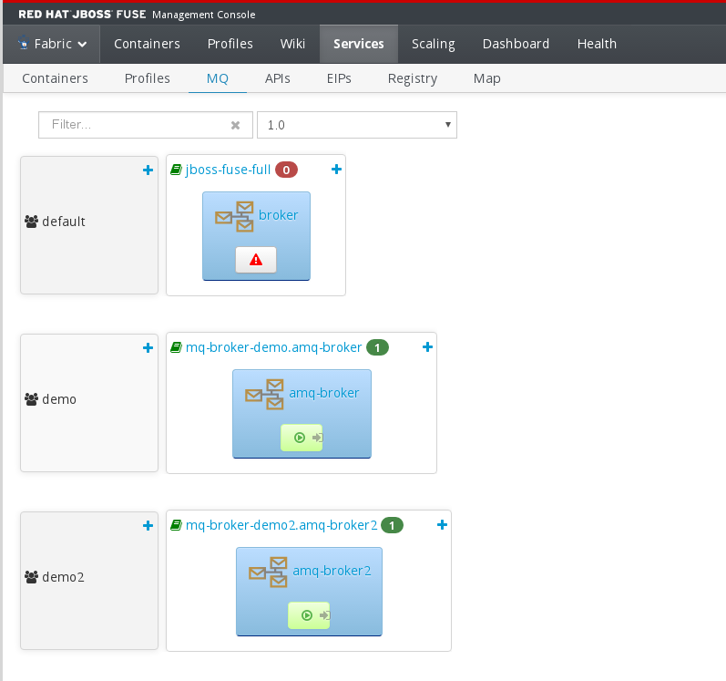
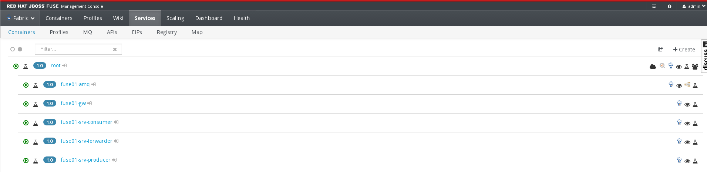
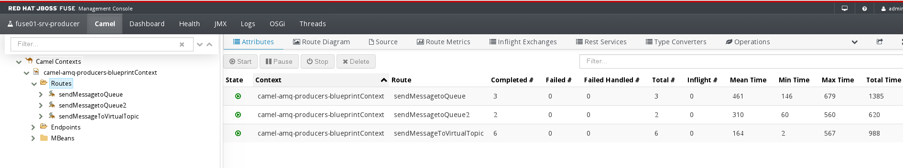
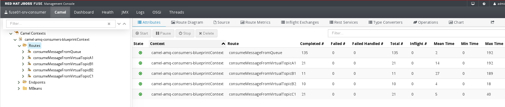
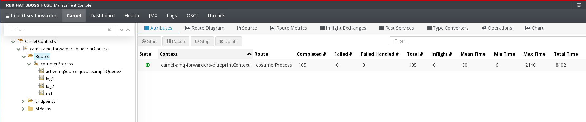
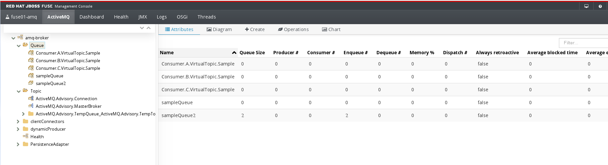
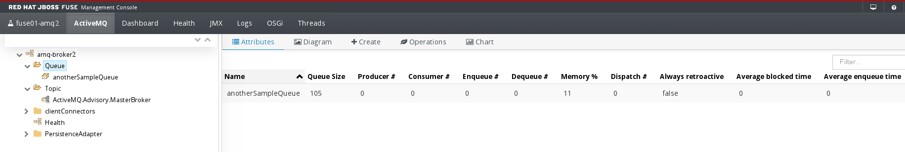

# camel-amq-samples
Camel Routes to manage messaging systems (Active-MQ)

These projects show you some route samples to manage JMS messages using the following capabilities:

__Red Hat JBoss Fuse 6.2__:
* Install Red Hat JBoss Fuse 6.2
* How to create a Fuse Fabric
* How to create different A-MQ Brokers and their containers
* How to create Gateway Containers
* How to create Service Containers

__Camel Context and Camel Routes__:
* How to use ActiveMQComponent in a Camel Context
* Sending (Producer) messages to a Queue in a Camel Route
* Reading (Consumer) messages from a Queue in a Camel Route
* Forward messages from a Messages Broker to another
* Use discovery/fabric capabilities to connect to a Message Broker
* Deploy bundles as profiles in a Fuse Fabric environment

# Project Structure
This project has the following structure

* __camel-amq-parent__:
* __camel-amq-producer__:
* __camel-amq-consumer__:
* __camel-amq-forwarder__:

# Install Red Hat JBoss Fuse

## Download
Download [Red Hat JBoss Fuse 6.2][1] binaries (subscription needed) from Red Hat Customer Portal

## Install
To install Red Hat JBoss Fuse follow the next instructions:

* Unzip .zip file into a specific folder
* Start Fuse with _bin/fuse_ or _bin/start_ shell scripts (.bat in Windows OS cases) 

	[root@rhel7jboss01 redhat]# unzip jboss-fuse-full-6.2.1.redhat-084.zip
	[root@rhel7jboss01 redhat]# cd jboss-fuse-6.2.1.redhat-084
	[root@rhel7jboss01 jboss-fuse]# ./bin/fuse
	Please wait while JBoss Fuse is loading...
	100% [========================================================================]
	  JBoss Fuse (6.2.1.redhat-084)
	  http://www.redhat.com/products/jbossenterprisemiddleware/fuse/
	
	Hit '<tab>' for a list of available commands
	and '[cmd] --help' for help on a specific command.
	
	Open a browser to http://localhost:8181 to access the management console
	
	Create a new Fabric via 'fabric:create'
	or join an existing Fabric via 'fabric:join [someUrls]'
	
	Hit '<ctrl-d>' or 'osgi:shutdown' to shutdown JBoss Fuse.
	
	No user found in etc/users.properties. Please use the 'esb:create-admin-user'
	command to create one.
	JBossFuse:karaf@root> 
	
## Create Fuse Fabric
_fabric:create_ is the Karaf command to create and define a new Fabric environment:

	JBossFuse:karaf@root> fabric:create --clean --bind-address rhel7jboss01 --new-user admin --new-user-password admin --zookeeper-password zookeeper --resolver localhostname --wait-for-provisioning 
	Waiting for container: root
	Waiting for container root to provision.
	JBossFuse:karaf@root> status
	[profile]                                [instances]    [health]
	fabric                                   1              100%
	fabric-ensemble-0000-1                   1              100%
	jboss-fuse-full                          1              100%

The _ensemble-list_ and _container-list_ commands will show us the status of the Fabric after its creation:

	JBossFuse:karaf@root> ensemble-list
	[id]
	root
	JBossFuse:karaf@root> container-list
	[id]   [version]  [type]  [connected]  [profiles]              [provision status]
	root*  1.0        karaf   yes          fabric                  success           
	                                       fabric-ensemble-0000-1                    
	                                       jboss-fuse-full                           

To reduce the resources used by the Fabric container, it is a good practice to remove the _jboss-fuse-full_ profile in Fabric containers:

	JBossFuse:karaf@root> container-remove-profile root jboss-fuse-full 

## Create MQ-Broker
We will create two Message Brokers:

* __amq-broker__: Broker to send and to receive messages. This broker will be used by _camel-amq-producer_ and _camel-amq-consumer_ projects
* __amq-broker2__: Broker to receive messages from the previous broker. This broker will be used by _camel_amq_forwarder_ project

	JBossFuse:karaf@root> mq-create --group demo --kind StandAlone --create-container fuse01-amq amq-broker
	MQ profile mq-broker-demo.amq-broker ready
	Creating new instance on SSH port 8102 and RMI ports 1100/44445 at: /opt/redhat/jboss-fuse-6.2.1.redhat-084/instances/fuse01-amq
	mq-create --group demo2 --kind StandAlone --create-container fuse01-amq2 amq-broker2
	JBossFuse:karaf@root> mq-create --group demo2 --kind StandAlone --create-container fuse01-amq2 amq-broker2
	MQ profile mq-broker-demo2.amq-broker2 ready
	Creating new instance on SSH port 8107 and RMI ports 1105/44450 at: /opt/redhat/jboss-fuse-6.2.1.redhat-084/instances/fuse01-amq2

We can review the status with the _container-list_ command: 

	JBossFuse:karaf@root> container-list
	[id]          [version]  [type]  [connected]  [profiles]                 [provision status]
	root*         1.0        karaf   yes          fabric                     success           
	                                              fabric-ensemble-0000-1                       
	  fuse01-amq  1.0        karaf   yes          mq-broker-demo.amq-broker  success
	  fuse01-amq2 1.0        karaf   yes          mq-broker-demo.amq-broker2 success

If you review using de Fuse Management Web Console, the screenshot will be similar to:

[More Information about MQ Brokers][2]

## Create Gateway Containers
The _Gateway Containers_ will work as the load balancers to access to the different services working on Fuse Fabric.

	JBossFuse:karaf@root> container-create-child --zookeeper-password zookeeper --profile gateway-mq root fuse01-gw
	Creating new instance on SSH port 8103 and RMI ports 1101/44446 at: /opt/redhat/jboss-fuse-6.2.1.redhat-084/instances/fuse01-gw
	The following containers have been created successfully:
		Container: fuse01-gw.
	JBossFuse:karaf@root> container-list
	[id]          [version]  [type]  [connected]  [profiles]                 [provision status]
	root*         1.0        karaf   yes          fabric                     success           
	                                              fabric-ensemble-0000-1                       
	  fuse01-amq  1.0        karaf   yes          mq-broker-demo.amq-broker  success           
	  fuse01-amq2 1.0        karaf   yes          mq-broker-demo.amq-broker2 success
	  fuse01-gw   1.0        karaf   yes          gateway-mq                 success        

[More Information about Gateway][3]

## Create Service Containers
Service Containers will be used to deploy the Camel Contexts and Camel Routes to manage the messages:

	JBossFuse:karaf@root> container-create-child --zookeeper-password zookeeper root fuse01-srv-producer
	Creating new instance on SSH port 8104 and RMI ports 1102/44447 at: /opt/redhat/jboss-fuse-6.2.1.redhat-084/instances/fuse01-srv-producer
	The following containers have been created successfully:
		Container: fuse01-srv-producer.
	JBossFuse:karaf@root> container-create-child --zookeeper-password zookeeper root fuse01-srv-consumer
	Creating new instance on SSH port 8105 and RMI ports 1103/44448 at: /opt/redhat/jboss-fuse-6.2.1.redhat-084/instances/fuse01-srv-consumer
	The following containers have been created successfully:
		Container: fuse01-srv-consumer.
	JBossFuse:karaf@root> container-create-child --zookeeper-password zookeeper root fuse01-srv-forwarder
	Creating new instance on SSH port 8106 and RMI ports 1104/44449 at: /opt/redhat/jboss-fuse-6.2.1.redhat-084/instances/fuse01-srv-forwarder
	The following containers have been created successfully:
		Container: fuse01-srv-forwarder.

After some minutes we will have the three containers ready to be used:

	JBossFuse:karaf@root> container-list
	[id]                    [version]  [type]  [connected]  [profiles]                 [provision status]
	root*                   1.0        karaf   yes          fabric                     success           
	                                                        fabric-ensemble-0000-1                       
	  fuse01-amq            1.0        karaf   yes          mq-broker-demo.amq-broker  success           
	  fuse01-amq2           1.0        karaf   yes          mq-broker-demo.amq-broker2 success
	  fuse01-gw             1.0        karaf   yes          gateway-mq                 success           
	  fuse01-srv-consumer   1.0        karaf   yes          default                    success           
	  fuse01-srv-forwarder  1.0        karaf   yes          default                    success           
	  fuse01-srv-producer   1.0        karaf   yes          default                    success           

If you review using the Fuse Management Web Console, the screenshot will be similar to:

Now our Fuse Fabric is ready to execute the services created in each Maven Project.

# Deploy Services into Fabric Environment

This section describes the steps needed to deploy these Camel Contexts into the Fuse Fabric environment created before. Basically the steps are:

* Review Fuse Fabric environment properties
* Build and install Maven artifacts
* Deploy into Fuse Fabric environment using _Fabric8 Maven Plug-In_  

[More informatio about Maven Fabric8 Plug-In][4]

## Review Fuse Fabric environment properties
To connect to our new Fuse Fabric Environment it is needed to define a _<server/>_ section in our __settings.xml__ file. These file is located into our `$MAVEN_REPO` folder (usually in `$USER_HOME/.m2` folder).

`fabric8.server.demo` is the name used to define the Fuse Fabric environment. Check it to use the right credentials:

	<!-- Fabric8 - Demo VM -->
	<server>
		<id>fabric8.server.demo</id>
		<username>admin</username>
		<password>admin</password>
	</server>

Also the __camel-amq-samples/pom.xml__ file has some properties to define the following Fuse Fabric Environment:

* local: Used to deploy into a local Fuse Fabric Environment
* remote: Used to deploy into a remote Fuse Fabric Environment. This environment will be used by `fabric8-remote` Maven profile defined in the parent project. 
	
Check them and set up the right values for each environment:
	 
	<!-- Joolokia Environments -->
	<joolokia.local>http://localhost:8181/jolokia</joolokia.local>
	<joolokia.remote>http://rhel7jboss01:8181/jolokia</joolokia.remote>
	<joolokia.remote.serverId>fabric8.server.demo</joolokia.remote.serverId>

## Build Maven Artifacts
To build the Maven artifacts we will use the `install` Maven goal: 

	[rmarting@rhel7 ~/Workspaces/github/camel-amq-samples/camel-amq-samples] mvn package
	[INFO] Scanning for projects...
	[INFO] ------------------------------------------------------------------------
	[INFO] Reactor Build Order:
	[INFO] 
	[INFO] camel-amq-parent
	[INFO] camel-amq-producer
	[INFO] camel-amq-consumer
	[INFO] camel-amq-forwarder
	[INFO]                                                                         
	[INFO] ------------------------------------------------------------------------
	[INFO] Building camel-amq-parent 1.0.0-SNAPSHOT
	[INFO] ------------------------------------------------------------------------
	[INFO] 
	...
	[INFO] Created profile zip file: target/profile.zip
	[INFO] Attaching aggregated zip /home/rmarting/Workspaces/github/camel-amq-samples/camel-amq-samples/target/profile.zip to root project camel-amq-parent
	[INFO] ------------------------------------------------------------------------
	[INFO] Reactor Summary:
	[INFO] 
	[INFO] camel-amq-parent ................................... SUCCESS [  2.692 s]
	[INFO] camel-amq-producer ................................. SUCCESS [  5.290 s]
	[INFO] camel-amq-consumer ................................. SUCCESS [  0.380 s]
	[INFO] camel-amq-forwarder ................................ SUCCESS [  3.737 s]
	[INFO] ------------------------------------------------------------------------
	[INFO] BUILD SUCCESS
	[INFO] ------------------------------------------------------------------------
	[INFO] Total time: 12.904 s
	[INFO] Finished at: 2016-09-05T12:58:23+02:00
	[INFO] Final Memory: 43M/491M
	[INFO] ------------------------------------------------------------------------

## Deploy Camel Context Producer
Move to __camel-amq-producer__ folder and execute the `fabric8:deploy` Maven goal: 

	[rmarting@rhel7 ~/Workspaces/github/camel-amq-samples/camel-amq-samples] cd camel-amq-producer
	[rmarting@rhel7 ~/Workspaces/github/camel-amq-samples/camel-amq-samples/camel-amq-producer] mvn -Pfabric8-remote clean install fabric8:deploy
	[INFO] Scanning for projects...
	[INFO]                                                                         
	[INFO] ------------------------------------------------------------------------
	[INFO] Building camel-amq-producer 1.0.30-SNAPSHOT
	[INFO] ------------------------------------------------------------------------
	[INFO] 
	...
	[INFO] --- fabric8-maven-plugin:1.2.0.redhat-621084:zip (zip) @ camel-amq-producer ---
	[INFO] Found class: org.apache.camel.CamelContext so adding the parent profile: feature-camel
	[INFO] Writing /home/rmarting/Workspaces/github/camel-amq-samples/camel-amq-samples/camel-amq-producer/target/generated-profiles/com.redhat.camel/camel/amq/producer.profile/dependencies/com.redhat.camel/camel-amq-producer-requirements.json
	[INFO] zipping file com.redhat.camel/camel/amq/producer.profile/ReadMe.md
	[INFO] zipping file com.redhat.camel/camel/amq/producer.profile/com.redhat.camel.environment.properties
	[INFO] zipping file com.redhat.camel/camel/amq/producer.profile/ReadMe.txt
	[INFO] zipping file com.redhat.camel/camel/amq/producer.profile/dependencies/com.redhat.camel/camel-amq-producer-requirements.json
	[INFO] zipping file com.redhat.camel/camel/amq/producer.profile/io.fabric8.agent.properties
	[INFO] Created profile zip file: /home/rmarting/Workspaces/github/camel-amq-samples/camel-amq-samples/camel-amq-producer/target/profile.zip
	[INFO] 
	...
	[INFO] --- fabric8-maven-plugin:1.2.0.redhat-621084:deploy (default-cli) @ camel-amq-producer ---
	[INFO] Found class: org.apache.camel.CamelContext so adding the parent profile: feature-camel
	[INFO] Adding needed remote repository: http://repository.jboss.org/nexus/content/groups/fs-public/
	[INFO] Uploading file /home/rmarting/Workspaces/github/camel-amq-samples/camel-amq-samples/camel-amq-producer/pom.xml
	Downloading: http://rhel7jboss01:8181/maven/upload/com/redhat/camel/camel-amq-producer/1.0.30-SNAPSHOT/maven-metadata.xml
	Uploading: http://rhel7jboss01:8181/maven/upload/com/redhat/camel/camel-amq-producer/1.0.30-SNAPSHOT/camel-amq-producer-1.0.30-20160905.111405-1.pom
	Uploaded: http://rhel7jboss01:8181/maven/upload/com/redhat/camel/camel-amq-producer/1.0.30-SNAPSHOT/camel-amq-producer-1.0.30-20160905.111405-1.pom (3 KB at 68.2 KB/sec)
	Downloading: http://rhel7jboss01:8181/maven/upload/com/redhat/camel/camel-amq-producer/maven-metadata.xml
	Uploading: http://rhel7jboss01:8181/maven/upload/com/redhat/camel/camel-amq-producer/1.0.30-SNAPSHOT/maven-metadata.xml
	Uploaded: http://rhel7jboss01:8181/maven/upload/com/redhat/camel/camel-amq-producer/1.0.30-SNAPSHOT/maven-metadata.xml (613 B at 19.3 KB/sec)
	Uploading: http://rhel7jboss01:8181/maven/upload/com/redhat/camel/camel-amq-producer/maven-metadata.xml
	Uploaded: http://rhel7jboss01:8181/maven/upload/com/redhat/camel/camel-amq-producer/maven-metadata.xml (295 B at 16.9 KB/sec)
	[INFO] Uploading file /home/rmarting/.m2/repository/com/redhat/camel/camel-amq-producer/1.0.30-SNAPSHOT/camel-amq-producer-1.0.30-SNAPSHOT.jar
	Uploading: http://rhel7jboss01:8181/maven/upload/com/redhat/camel/camel-amq-producer/1.0.30-SNAPSHOT/camel-amq-producer-1.0.30-20160905.111405-1.jar
	Uploaded: http://rhel7jboss01:8181/maven/upload/com/redhat/camel/camel-amq-producer/1.0.30-SNAPSHOT/camel-amq-producer-1.0.30-20160905.111405-1.jar (31 KB at 1132.6 KB/sec)
	Uploading: http://rhel7jboss01:8181/maven/upload/com/redhat/camel/camel-amq-producer/1.0.30-SNAPSHOT/camel-amq-producer-1.0.30-20160905.111405-1.pom
	Uploaded: http://rhel7jboss01:8181/maven/upload/com/redhat/camel/camel-amq-producer/1.0.30-SNAPSHOT/camel-amq-producer-1.0.30-20160905.111405-1.pom (3 KB at 96.4 KB/sec)
	Uploading: http://rhel7jboss01:8181/maven/upload/com/redhat/camel/camel-amq-producer/1.0.30-SNAPSHOT/maven-metadata.xml
	Uploaded: http://rhel7jboss01:8181/maven/upload/com/redhat/camel/camel-amq-producer/1.0.30-SNAPSHOT/maven-metadata.xml (787 B at 38.4 KB/sec)
	[INFO] Uploading file /home/rmarting/Workspaces/github/camel-amq-samples/camel-amq-samples/camel-amq-producer/target/profile.zip
	Uploading: http://rhel7jboss01:8181/maven/upload/com/redhat/camel/camel-amq-producer/1.0.30-SNAPSHOT/camel-amq-producer-1.0.30-20160905.111405-1-profile.zip
	Uploaded: http://rhel7jboss01:8181/maven/upload/com/redhat/camel/camel-amq-producer/1.0.30-SNAPSHOT/camel-amq-producer-1.0.30-20160905.111405-1-profile.zip (4 KB at 178.9 KB/sec)
	Uploading: http://rhel7jboss01:8181/maven/upload/com/redhat/camel/camel-amq-producer/1.0.30-SNAPSHOT/maven-metadata.xml
	Uploaded: http://rhel7jboss01:8181/maven/upload/com/redhat/camel/camel-amq-producer/1.0.30-SNAPSHOT/maven-metadata.xml (1002 B at 44.5 KB/sec)
	[INFO] Updating profile: com.redhat.camel-camel-amq-producer with parent profile(s): [feature-camel] using OSGi resolver
	[INFO] About to invoke mbean io.fabric8:type=ProjectDeployer on jolokia URL: http://rhel7jboss01:8181/jolokia with user: admin
	[INFO] 
	[INFO] Profile page: http://rhel7jboss01:8181/hawtio/index.html#/wiki/branch/1.0/view/fabric/profiles/com.redhat.camel/camel/amq/producer.profile
	[INFO] 
	[INFO] Uploading file ReadMe.md to invoke mbean io.fabric8:type=Fabric on jolokia URL: http://rhel7jboss01:8181/jolokia with user: admin
	[INFO] Uploading file com.redhat.camel.environment.properties to invoke mbean io.fabric8:type=Fabric on jolokia URL: http://rhel7jboss01:8181/jolokia with user: admin
	[INFO] Performing profile refresh on mbean: io.fabric8:type=Fabric version: 1.0 profile: com.redhat.camel-camel-amq-producer
	[INFO] ------------------------------------------------------------------------
	[INFO] BUILD SUCCESS
	[INFO] ------------------------------------------------------------------------
	[INFO] Total time: 02:11 min
	[INFO] Finished at: 2016-09-05T13:16:03+02:00
	[INFO] Final Memory: 46M/507M
	[INFO] ------------------------------------------------------------------------

In Fuse Fabric we could check the status of this new profile:

	JBossFuse:karaf@root> profile-display com.redhat.camel-camel-amq-producer 
	Profile id: com.redhat.camel-camel-amq-producer
	Version   : 1.0
	Attributes: 
		abstract: false
		parents: feature-camel
	Containers: 
	
	Container settings
	----------------------------
	Features : 
		mq-fabric
		camel-amq
	
	Bundles : 
		mvn:com.redhat.camel/camel-amq-producer/1.0.30-SNAPSHOT
	
	Agent Properties : 
		  lastRefresh.com.redhat.camel-camel-amq-producer = 1473074135462
	
	
	Configuration details
	----------------------------
	PID: io.fabric8.web.contextPath
	  com.redhat.camel/camel-amq-producer camel-amq-producer
	
	
	PID: com.redhat.camel.environment
	  amq.producer.brokerURL discovery:(fabric:demo)
	  common.prop01 Value for common.prop01
	  env.prop01 Value for env.prop01
	  amq.producer.userName admin
	  amq.producer.password admin
	
	
	
	Other resources
	----------------------------
	Resource: ReadMe.md

Finally we assign this profile to the Service Container created to execute its Camel Context:	

	JBossFuse:karaf@root> container-add-profile fuse01-srv-producer com.redhat.camel-camel-amq-producer

After some minutes we could check the Camel Routes executions in the log files of this container. If there is not errors, the Camel Routes will show the following log messages:

	2016-09-05 19:47:16,099 | INFO  | ://amq-sender-vt | sendMessageToVirtualTopic        | 170 - org.apache.camel.camel-core - 2.15.1.redhat-621084 | Sending Message '#2723' to virtual topic at discovery:(fabric:demo) Broker
	2016-09-05 19:47:16,100 | INFO  | er://amq-sender2 | sendMessagetoQueue2              | 170 - org.apache.camel.camel-core - 2.15.1.redhat-621084 | Sending Message '#3234' to 'sampleQueue2' at discovery:(fabric:demo) Broker
	2016-09-05 19:47:16,104 | INFO  | mer://amq-sender | sendMessagetoQueue               | 170 - org.apache.camel.camel-core - 2.15.1.redhat-621084 | Sending Message '#4962' to queue at discovery:(fabric:demo) Broker. Credentials: admin-admin

If we review the Service Container status using the Fuse Management Web Console, the screenshoot will be similar to the next one:

## Deploy Camel Context Consumers
Move to __camel-amq-consumer__ folder and execute the `fabric8:deploy` Maven goal:

	[rmarting@rhel7 ~/Workspaces/github/camel-amq-samples/camel-amq-samples] cd camel-amq-consumer
	[rmarting@rhel7 ~/Workspaces/github/camel-amq-samples/camel-amq-samples/camel-amq-producer] mvn -Pfabric8-remote clean install fabric8:deploy
	[INFO] Scanning for projects...
	[INFO]                                                                         
	[INFO] ------------------------------------------------------------------------
	[INFO] Building camel-amq-consumer 1.0.22-SNAPSHOT
	[INFO] ------------------------------------------------------------------------
	[INFO] 
	...
	[INFO] --- fabric8-maven-plugin:1.2.0.redhat-621084:zip (zip) @ camel-amq-consumer ---
	[INFO] Found class: org.apache.camel.CamelContext so adding the parent profile: feature-camel
	[INFO] Writing /home/rmarting/Workspaces/github/camel-amq-samples/camel-amq-samples/camel-amq-consumer/target/generated-profiles/com.redhat.camel/camel/amq/consumer.profile/dependencies/com.redhat.camel/camel-amq-consumer-requirements.json
	[INFO] zipping file com.redhat.camel/camel/amq/consumer.profile/ReadMe.md
	[INFO] zipping file com.redhat.camel/camel/amq/consumer.profile/com.redhat.camel.environment.properties
	[INFO] zipping file com.redhat.camel/camel/amq/consumer.profile/ReadMe.txt
	[INFO] zipping file com.redhat.camel/camel/amq/consumer.profile/dependencies/com.redhat.camel/camel-amq-consumer-requirements.json
	[INFO] zipping file com.redhat.camel/camel/amq/consumer.profile/io.fabric8.agent.properties
	[INFO] Created profile zip file: /home/rmarting/Workspaces/github/camel-amq-samples/camel-amq-samples/camel-amq-consumer/target/profile.zip
	[INFO] 
	...
	[INFO] --- fabric8-maven-plugin:1.2.0.redhat-621084:deploy (default-cli) @ camel-amq-consumer ---
	[INFO] Found class: org.apache.camel.CamelContext so adding the parent profile: feature-camel
	[INFO] Adding needed remote repository: http://repository.jboss.org/nexus/content/groups/fs-public/
	[INFO] Uploading file /home/rmarting/Workspaces/github/camel-amq-samples/camel-amq-samples/camel-amq-consumer/pom.xml
	Downloading: http://rhel7jboss01:8181/maven/upload/com/redhat/camel/camel-amq-consumer/1.0.22-SNAPSHOT/maven-metadata.xml
	Uploading: http://rhel7jboss01:8181/maven/upload/com/redhat/camel/camel-amq-consumer/1.0.22-SNAPSHOT/camel-amq-consumer-1.0.22-20160905.112128-1.pom
	Uploaded: http://rhel7jboss01:8181/maven/upload/com/redhat/camel/camel-amq-consumer/1.0.22-SNAPSHOT/camel-amq-consumer-1.0.22-20160905.112128-1.pom (3 KB at 90.2 KB/sec)
	Downloading: http://rhel7jboss01:8181/maven/upload/com/redhat/camel/camel-amq-consumer/maven-metadata.xml
	Uploading: http://rhel7jboss01:8181/maven/upload/com/redhat/camel/camel-amq-consumer/1.0.22-SNAPSHOT/maven-metadata.xml
	Uploaded: http://rhel7jboss01:8181/maven/upload/com/redhat/camel/camel-amq-consumer/1.0.22-SNAPSHOT/maven-metadata.xml (613 B at 31.5 KB/sec)
	Uploading: http://rhel7jboss01:8181/maven/upload/com/redhat/camel/camel-amq-consumer/maven-metadata.xml
	Uploaded: http://rhel7jboss01:8181/maven/upload/com/redhat/camel/camel-amq-consumer/maven-metadata.xml (295 B at 16.0 KB/sec)
	[INFO] Uploading file /home/rmarting/.m2/repository/com/redhat/camel/camel-amq-consumer/1.0.22-SNAPSHOT/camel-amq-consumer-1.0.22-SNAPSHOT.jar
	Uploading: http://rhel7jboss01:8181/maven/upload/com/redhat/camel/camel-amq-consumer/1.0.22-SNAPSHOT/camel-amq-consumer-1.0.22-20160905.112128-1.jar
	Uploaded: http://rhel7jboss01:8181/maven/upload/com/redhat/camel/camel-amq-consumer/1.0.22-SNAPSHOT/camel-amq-consumer-1.0.22-20160905.112128-1.jar (29 KB at 1256.7 KB/sec)
	Uploading: http://rhel7jboss01:8181/maven/upload/com/redhat/camel/camel-amq-consumer/1.0.22-SNAPSHOT/camel-amq-consumer-1.0.22-20160905.112128-1.pom
	Uploaded: http://rhel7jboss01:8181/maven/upload/com/redhat/camel/camel-amq-consumer/1.0.22-SNAPSHOT/camel-amq-consumer-1.0.22-20160905.112128-1.pom (3 KB at 133.2 KB/sec)
	Uploading: http://rhel7jboss01:8181/maven/upload/com/redhat/camel/camel-amq-consumer/1.0.22-SNAPSHOT/maven-metadata.xml
	Uploaded: http://rhel7jboss01:8181/maven/upload/com/redhat/camel/camel-amq-consumer/1.0.22-SNAPSHOT/maven-metadata.xml (787 B at 40.5 KB/sec)
	[INFO] Uploading file /home/rmarting/Workspaces/github/camel-amq-samples/camel-amq-samples/camel-amq-consumer/target/profile.zip
	Uploading: http://rhel7jboss01:8181/maven/upload/com/redhat/camel/camel-amq-consumer/1.0.22-SNAPSHOT/camel-amq-consumer-1.0.22-20160905.112128-1-profile.zip
	Uploaded: http://rhel7jboss01:8181/maven/upload/com/redhat/camel/camel-amq-consumer/1.0.22-SNAPSHOT/camel-amq-consumer-1.0.22-20160905.112128-1-profile.zip (4 KB at 194.4 KB/sec)
	Uploading: http://rhel7jboss01:8181/maven/upload/com/redhat/camel/camel-amq-consumer/1.0.22-SNAPSHOT/maven-metadata.xml
	Uploaded: http://rhel7jboss01:8181/maven/upload/com/redhat/camel/camel-amq-consumer/1.0.22-SNAPSHOT/maven-metadata.xml (1002 B at 48.9 KB/sec)
	[INFO] Updating profile: com.redhat.camel-camel-amq-consumer with parent profile(s): [feature-camel] using OSGi resolver
	[INFO] About to invoke mbean io.fabric8:type=ProjectDeployer on jolokia URL: http://rhel7jboss01:8181/jolokia with user: admin
	[INFO] 
	[INFO] Profile page: http://rhel7jboss01:8181/hawtio/index.html#/wiki/branch/1.0/view/fabric/profiles/com.redhat.camel/camel/amq/consumer.profile
	[INFO] 
	[INFO] Uploading file ReadMe.md to invoke mbean io.fabric8:type=Fabric on jolokia URL: http://rhel7jboss01:8181/jolokia with user: admin
	[INFO] Uploading file com.redhat.camel.environment.properties to invoke mbean io.fabric8:type=Fabric on jolokia URL: http://rhel7jboss01:8181/jolokia with user: admin
	[INFO] Performing profile refresh on mbean: io.fabric8:type=Fabric version: 1.0 profile: com.redhat.camel-camel-amq-consumer
	[INFO] ------------------------------------------------------------------------
	[INFO] BUILD SUCCESS
	[INFO] ------------------------------------------------------------------------
	[INFO] Total time: 01:54 min
	[INFO] Finished at: 2016-09-05T13:23:13+02:00
	[INFO] Final Memory: 41M/497M
	[INFO] ------------------------------------------------------------------------

Display the new profile info:

	JBossFuse:karaf@root> profile-display com.redhat.camel-camel-amq-consumer 
	Profile id: com.redhat.camel-camel-amq-consumer
	Version   : 1.0
	Attributes: 
		abstract: false
		parents: feature-camel
	Containers: 
	
	Container settings
	----------------------------
	Features : 
		mq-fabric
		camel-amq
	
	Bundles : 
		mvn:com.redhat.camel/camel-amq-consumer/1.0.22-SNAPSHOT
	
	Agent Properties : 
		  lastRefresh.com.redhat.camel-camel-amq-consumer = 1473074561145
	
	
	Configuration details
	----------------------------
	PID: io.fabric8.web.contextPath
	  com.redhat.camel/camel-amq-consumer camel-amq-consumer
	
	
	PID: com.redhat.camel.environment
	  amq.producer.brokerURL discovery:(fabric:default)
	  common.prop01 Value for common.prop01
	  env.prop01 Value for env.prop01
	  amq.producer.userName admin
	  amq.producer.password admin
	
	
	
	Other resources
	----------------------------
	Resource: ReadMe.md

Finally we assign this profile to the Service Container created to execute its Camel Context:

	JBossFuse:karaf@root> container-add-profile fuse01-srv-consumer com.redhat.camel-camel-amq-consumer

After some minutes we could check the Camel Routes executions in the log files of this container. If there is not errors, the Camel Routes will show the following log messages:

	2016-09-05 19:47:19,702 | INFO  | mer[sampleQueue] | consumeMessageFromQueue          | 123 - org.apache.camel.camel-core - 2.15.1.redhat-621084 | Message '4962' consumed from queue at discovery:(fabric:demo)
	2016-09-05 19:47:19,953 | INFO  | ualTopic.Sample] | consumeMessageFromVirtualTopicB2 | 123 - org.apache.camel.camel-core - 2.15.1.redhat-621084 | [CON-B2] Message '2723' consumed from virtual topic at discovery:(fabric:demo)
	2016-09-05 19:47:20,050 | INFO  | ualTopic.Sample] | consumeMessageFromVirtualTopicA1 | 123 - org.apache.camel.camel-core - 2.15.1.redhat-621084 | [CON-A1] Message '2723' consumed from virtual topic at discovery:(fabric:demo)
	2016-09-05 19:47:20,065 | INFO  | ualTopic.Sample] | consumeMessageFromVirtualTopicC1 | 123 - org.apache.camel.camel-core - 2.15.1.redhat-621084 | [CON-C1] Message '2723' consumed from virtual topic at discovery:(fabric:demo)
	2016-09-05 19:47:46,114 | INFO  | ualTopic.Sample] | consumeMessageFromVirtualTopicB1 | 123 - org.apache.camel.camel-core - 2.15.1.redhat-621084 | [CON-B1] Message '5155' consumed from virtual topic at discovery:(fabric:demo)
	2016-09-05 19:47:46,147 | INFO  | ualTopic.Sample] | consumeMessageFromVirtualTopicC1 | 123 - org.apache.camel.camel-core - 2.15.1.redhat-621084 | [CON-C1] Message '5155' consumed from virtual topic at discovery:(fabric:demo)
	2016-09-05 19:47:46,155 | INFO  | ualTopic.Sample] | consumeMessageFromVirtualTopicA1 | 123 - org.apache.camel.camel-core - 2.15.1.redhat-621084 | [CON-A1] Message '5155' consumed from virtual topic at discovery:(fabric:demo)
	2016-09-05 19:48:16,076 | INFO  | ualTopic.Sample] | consumeMessageFromVirtualTopicB2 | 123 - org.apache.camel.camel-core - 2.15.1.redhat-621084 | [CON-B2] Message '4928' consumed from virtual topic at discovery:(fabric:demo)
	2016-09-05 19:48:16,139 | INFO  | ualTopic.Sample] | consumeMessageFromVirtualTopicC1 | 123 - org.apache.camel.camel-core - 2.15.1.redhat-621084 | [CON-C1] Message '4928' consumed from virtual topic at discovery:(fabric:demo)
	2016-09-05 19:48:16,139 | INFO  | ualTopic.Sample] | consumeMessageFromVirtualTopicA1 | 123 - org.apache.camel.camel-core - 2.15.1.redhat-621084 | [CON-A1] Message '4928' consumed from virtual topic at discovery:(fabric:demo)
	2016-09-05 19:48:16,243 | INFO  | mer[sampleQueue] | consumeMessageFromQueue          | 123 - org.apache.camel.camel-core - 2.15.1.redhat-621084 | Message '7941' consumed from queue at discovery:(fabric:demo)

If we review the Service Container status using the Fuse Management Web Console, the screenshoot will be similar to the next one:

## Deploy Camel Context Forwarder
Move to __camel-amq-forwarder__ folder and execute the `fabric8:deploy` Maven goal:

	[rmarting@rhel7 ~/Workspaces/github/camel-amq-samples/camel-amq-samples] cd camel-amq-forwarder
	[rmarting@rhel7 ~/Workspaces/github/camel-amq-samples/camel-amq-samples/camel-amq-producer] mvn -Pfabric8-remote clean install fabric8:deploy
	[INFO] Scanning for projects...
	[INFO]                                                                         
	[INFO] ------------------------------------------------------------------------
	[INFO] Building camel-amq-forwarder 1.0.3-SNAPSHOT
	[INFO] ------------------------------------------------------------------------
	[INFO] 
	...
	[INFO] --- fabric8-maven-plugin:1.2.0.redhat-621084:zip (zip) @ camel-amq-forwarder ---
	[INFO] Found class: org.apache.camel.CamelContext so adding the parent profile: feature-camel
	[INFO] Writing /home/rmarting/Workspaces/github/camel-amq-samples/camel-amq-samples/camel-amq-forwarder/target/generated-profiles/com.redhat.camel/camel/amq/forwarder.profile/dependencies/com.redhat.camel/camel-amq-forwarder-requirements.json
	[INFO] zipping file com.redhat.camel/camel/amq/forwarder.profile/ReadMe.md
	[INFO] zipping file com.redhat.camel/camel/amq/forwarder.profile/com.redhat.camel.environment.properties
	[INFO] zipping file com.redhat.camel/camel/amq/forwarder.profile/ReadMe.txt
	[INFO] zipping file com.redhat.camel/camel/amq/forwarder.profile/dependencies/com.redhat.camel/camel-amq-forwarder-requirements.json
	[INFO] zipping file com.redhat.camel/camel/amq/forwarder.profile/io.fabric8.agent.properties
	[INFO] Created profile zip file: /home/rmarting/Workspaces/github/camel-amq-samples/camel-amq-samples/camel-amq-forwarder/target/profile.zip
	[INFO] 
	...
	[INFO] --- fabric8-maven-plugin:1.2.0.redhat-621084:deploy (default-cli) @ camel-amq-forwarder ---
	[INFO] Found class: org.apache.camel.CamelContext so adding the parent profile: feature-camel
	[INFO] Adding needed remote repository: http://repository.jboss.org/nexus/content/groups/fs-public/
	[INFO] Uploading file /home/rmarting/Workspaces/github/camel-amq-samples/camel-amq-samples/camel-amq-forwarder/pom.xml
	Downloading: http://rhel7jboss01:8181/maven/upload/com/redhat/camel/camel-amq-forwarder/1.0.3-SNAPSHOT/maven-metadata.xml
	Uploading: http://rhel7jboss01:8181/maven/upload/com/redhat/camel/camel-amq-forwarder/1.0.3-SNAPSHOT/camel-amq-forwarder-1.0.3-20160905.112537-1.pom
	Uploaded: http://rhel7jboss01:8181/maven/upload/com/redhat/camel/camel-amq-forwarder/1.0.3-SNAPSHOT/camel-amq-forwarder-1.0.3-20160905.112537-1.pom (3 KB at 87.4 KB/sec)
	Downloading: http://rhel7jboss01:8181/maven/upload/com/redhat/camel/camel-amq-forwarder/maven-metadata.xml
	Uploading: http://rhel7jboss01:8181/maven/upload/com/redhat/camel/camel-amq-forwarder/1.0.3-SNAPSHOT/maven-metadata.xml
	Uploaded: http://rhel7jboss01:8181/maven/upload/com/redhat/camel/camel-amq-forwarder/1.0.3-SNAPSHOT/maven-metadata.xml (612 B at 35.2 KB/sec)
	Uploading: http://rhel7jboss01:8181/maven/upload/com/redhat/camel/camel-amq-forwarder/maven-metadata.xml
	Uploaded: http://rhel7jboss01:8181/maven/upload/com/redhat/camel/camel-amq-forwarder/maven-metadata.xml (295 B at 16.9 KB/sec)
	[INFO] Uploading file /home/rmarting/.m2/repository/com/redhat/camel/camel-amq-forwarder/1.0.3-SNAPSHOT/camel-amq-forwarder-1.0.3-SNAPSHOT.jar
	Uploading: http://rhel7jboss01:8181/maven/upload/com/redhat/camel/camel-amq-forwarder/1.0.3-SNAPSHOT/camel-amq-forwarder-1.0.3-20160905.112537-1.jar
	Uploaded: http://rhel7jboss01:8181/maven/upload/com/redhat/camel/camel-amq-forwarder/1.0.3-SNAPSHOT/camel-amq-forwarder-1.0.3-20160905.112537-1.jar (29 KB at 1447.5 KB/sec)
	Uploading: http://rhel7jboss01:8181/maven/upload/com/redhat/camel/camel-amq-forwarder/1.0.3-SNAPSHOT/camel-amq-forwarder-1.0.3-20160905.112537-1.pom
	Uploaded: http://rhel7jboss01:8181/maven/upload/com/redhat/camel/camel-amq-forwarder/1.0.3-SNAPSHOT/camel-amq-forwarder-1.0.3-20160905.112537-1.pom (3 KB at 164.5 KB/sec)
	Uploading: http://rhel7jboss01:8181/maven/upload/com/redhat/camel/camel-amq-forwarder/1.0.3-SNAPSHOT/maven-metadata.xml
	Uploaded: http://rhel7jboss01:8181/maven/upload/com/redhat/camel/camel-amq-forwarder/1.0.3-SNAPSHOT/maven-metadata.xml (785 B at 47.9 KB/sec)
	[INFO] Uploading file /home/rmarting/Workspaces/github/camel-amq-samples/camel-amq-samples/camel-amq-forwarder/target/profile.zip
	Uploading: http://rhel7jboss01:8181/maven/upload/com/redhat/camel/camel-amq-forwarder/1.0.3-SNAPSHOT/camel-amq-forwarder-1.0.3-20160905.112537-1-profile.zip
	Uploaded: http://rhel7jboss01:8181/maven/upload/com/redhat/camel/camel-amq-forwarder/1.0.3-SNAPSHOT/camel-amq-forwarder-1.0.3-20160905.112537-1-profile.zip (4 KB at 209.5 KB/sec)
	Uploading: http://rhel7jboss01:8181/maven/upload/com/redhat/camel/camel-amq-forwarder/1.0.3-SNAPSHOT/maven-metadata.xml
	Uploaded: http://rhel7jboss01:8181/maven/upload/com/redhat/camel/camel-amq-forwarder/1.0.3-SNAPSHOT/maven-metadata.xml (999 B at 69.7 KB/sec)
	[INFO] Updating profile: com.redhat.camel-camel-amq-forwarder with parent profile(s): [feature-camel] using OSGi resolver
	[INFO] About to invoke mbean io.fabric8:type=ProjectDeployer on jolokia URL: http://rhel7jboss01:8181/jolokia with user: admin
	[INFO] 
	[INFO] Profile page: http://rhel7jboss01:8181/hawtio/index.html#/wiki/branch/1.0/view/fabric/profiles/com.redhat.camel/camel/amq/forwarder.profile
	[INFO] 
	[INFO] Uploading file ReadMe.md to invoke mbean io.fabric8:type=Fabric on jolokia URL: http://rhel7jboss01:8181/jolokia with user: admin
	[INFO] Uploading file com.redhat.camel.environment.properties to invoke mbean io.fabric8:type=Fabric on jolokia URL: http://rhel7jboss01:8181/jolokia with user: admin
	[INFO] Performing profile refresh on mbean: io.fabric8:type=Fabric version: 1.0 profile: com.redhat.camel-camel-amq-forwarder
	[INFO] ------------------------------------------------------------------------
	[INFO] BUILD SUCCESS
	[INFO] ------------------------------------------------------------------------
	[INFO] Total time: 01:36 min
	[INFO] Finished at: 2016-09-05T13:27:04+02:00
	[INFO] Final Memory: 48M/872M
	[INFO] ------------------------------------------------------------------------

Display the new profile info:

	JBossFuse:karaf@root> profile-display com.redhat.camel-camel-amq-forwarder 
	Profile id: com.redhat.camel-camel-amq-forwarder
	Version   : 1.0
	Attributes: 
		abstract: false
		parents: feature-camel
	Containers: 
	
	Container settings
	----------------------------
	Features : 
		mq-fabric
		camel-amq
	
	Bundles : 
		mvn:com.redhat.camel/camel-amq-forwarder/1.0.3-SNAPSHOT
	
	Agent Properties : 
		  lastRefresh.com.redhat.camel-camel-amq-forwarder = 1473074799120
	
	
	Configuration details
	----------------------------
	PID: io.fabric8.web.contextPath
	  com.redhat.camel/camel-amq-forwarder camel-amq-forwarder
	
	
	PID: com.redhat.camel.environment
	  amq.source.password admin
	  amq.destination.userName admin
	  common.prop01 Value for common.prop01
	  amq.destination.password admin
	  amq.source.brokerURL discovery:(fabric:default)
	  env.prop01 Value for env.prop01
	  amq.source.userName admin
	  amq.destination.brokerURL discovery:(fabric:demo)
	
	
	
	Other resources
	----------------------------
	Resource: ReadMe.md

Finally we assign this profile to the Service Container created to execute its Camel Context:

	JBossFuse:karaf@root> container-add-profile fuse01-srv-forwarder com.redhat.camel-camel-amq-forwarder

After some minutes we could check the Camel Routes executions in the log files of this container. If there is not errors, the Camel Routes will show the following log messages:

	2016-09-05 19:47:19,360 | INFO  | er[sampleQueue2] | cosumerProcess                   | 123 - org.apache.camel.camel-core - 2.15.1.redhat-621084 | Message '#3234' consumed from 'sampleQueue2' at discovery:(fabric:demo) 
	2016-09-05 19:47:19,361 | INFO  | er[sampleQueue2] | cosumerProcess                   | 123 - org.apache.camel.camel-core - 2.15.1.redhat-621084 | Message '#3234' sent to 'anotherSampleQueue' at discovery:(fabric:demo2) 
	2016-09-05 19:48:46,189 | INFO  | er[sampleQueue2] | cosumerProcess                   | 123 - org.apache.camel.camel-core - 2.15.1.redhat-621084 | Message '#2406' consumed from 'sampleQueue2' at discovery:(fabric:demo) 
	2016-09-05 19:48:46,190 | INFO  | er[sampleQueue2] | cosumerProcess                   | 123 - org.apache.camel.camel-core - 2.15.1.redhat-621084 | Message '#2406' sent to 'anotherSampleQueue' at discovery:(fabric:demo2) 

If we review the Service Container status using the Fuse Management Web Console, the screenshoot will be similar to the next one:

			 

## Monitoring A-MQ Brokers
If we review the AMQ Broker's status in the Fuse Management Web Console, the following screenshoots will be similar to:

We could identify the different queues and topics created and used by the different Camel Routes.

## Fuse Discovery Protocol
The Camel Routes use the _fabric discovery agent_ to connect with the different brokers. This method allows us to avoid to use the final container's ports and its hostnames. Fabric will discover the brokers created and will create the connections to the final containers.

To use this discovery method the broker URL will be similar to: 

	amq.producer.brokerURL=discovery:(fabric:demo)

More information about [Fuse Fabric Discovery Agent][5] and [how to connect to a broker][6].

<!-- Reference Links -->

[1]: https://access.redhat.com/jbossnetwork/restricted/softwareDetail.html?softwareId=41311&product=jboss.fuse&version=6.2.1&downloadType=distributions "Red Hat JBoss Fuse 6.2"
[2]: https://access.redhat.com/documentation/en-US/Red_Hat_JBoss_Fuse/6.2/html/Fabric_Guide/MQ.html "Chapter 6. Active-MQ brokers and Clusters"
[3]: https://access.redhat.com/documentation/en-US/Red_Hat_JBoss_Fuse/6.2/html/Fabric_Guide/Gateway.html "Chapter 10. Gateway"
[4]: https://access.redhat.com/documentation/en-US/Red_Hat_JBoss_Fuse/6.2.1/html/Fabric_Guide/F8Plugin.html
[5]: https://access.redhat.com/documentation/en-US/Red_Hat_JBoss_A-MQ/6.0/html/Fault_Tolerant_Messaging/files/FMQNetworksFabricDiscovery.html
[6]: https://access.redhat.com/documentation/en-US/Red_Hat_JBoss_Fuse/6.2.1/html/Fabric_Guide/MQ-Connecting.html
